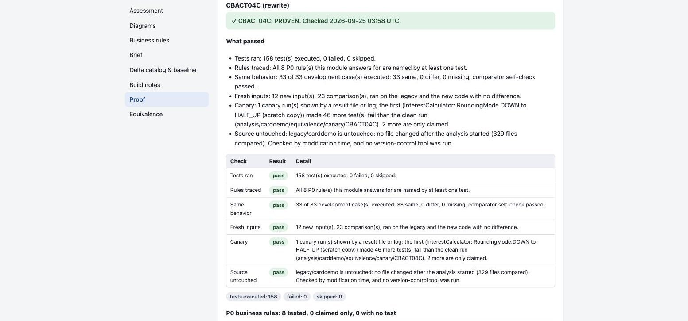
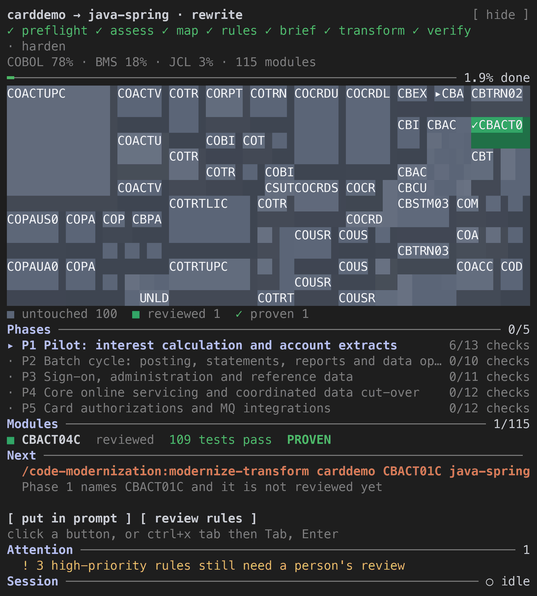

# Code Modernization

> **Premessa:** questo repository è un clone del plugin [`code-modernization`](https://github.com/anthropics/claude-plugins-official/tree/main/plugins/code-modernization) di Anthropic. L'unica differenza è l'italiano: README, descrizioni di comandi e agenti, domande all'utente e report generati sono in italiano (la direttiva è in [LANGUAGE.md](LANGUAGE.md)). Nomi dei comandi, parole chiave e file letti dagli script restano in inglese.
>
> Per le operazioni di tutti i giorni (modificare le traduzioni, gestire le Pull Request di sincronizzazione con l'upstream) la guida di riferimento è [OPERATIONS.md](../../OPERATIONS.md). [UPSTREAM_SYNC_ACTION_CODE_MODERNIZATION.md](../../UPSTREAM_SYNC_ACTION_CODE_MODERNIZATION.md) descrive invece il funzionamento tecnico della GitHub Action di sincronizzazione: non serve metterci mano, se non in caso di problemi.

Punta Claude su una codebase legacy e ottieni quattro cose: la comprensione di cosa è e di cosa fa, un piano che approvi tu, il codice modernizzato e **la prova che il nuovo codice si comporta come il vecchio**. Funziona con qualsiasi linguaggio e qualsiasi tipo di intervento: una versione più recente della stessa tecnologia, una riscrittura in un'altra tecnologia o una ricostruzione su una nuova architettura.


## Installazione

Ti serve [Claude Code](https://code.claude.com). Poi:

```
/plugin marketplace add alangiacomin/claude-marketplace
/plugin install code-modernization@alan.giacomin
```

Il plugin è pubblicato nel marketplace `alan.giacomin` (vedi il README nella radice del repository). Per provarlo da un clone locale: `/plugin marketplace add /percorso/del/clone`.

Alcuni passi avviano molti agenti contemporaneamente, quindi su un sistema grande aspettati un consumo reale (vedi *Cosa aspettarsi*). Parti da un solo modulo o una sola unità come pilota, non dall'intero patrimonio applicativo.

## Da dove iniziare

Apri una cartella per il lavoro e digita `/code-modernization:modernize`. Ti chiede cosa vuoi fare del tuo codice (un paio di domande brevi), trova il codice, scrive le tue risposte una volta sola, mostra la strada da percorrere e ti dà il primo comando esatto. Ogni comando successivo legge ciò che hai detto, quindi nulla viene chiesto due volte. **Non sai cosa vuoi?** Scegli *Understand it first* (prima capirlo): ottieni la valutazione, la mappa, le regole di business e un piano, e nessun codice viene ricostruito.

Per procedere passo per passo, punta il primo comando al tuo codice e segui la riga "next step" (prossimo passo) con cui termina ogni comando:

```
/code-modernization:modernize-preflight <name> --source <path to your code>
/code-modernization:modernize-status <name>       # where am I, and what is next: run it any time
```

`<name>` è un'etichetta breve a tua scelta (lettere, cifre, `-`, `_`). `--source` crea un link in `legacy/<name>` e non copia nulla, quindi un repository enorme resta dove si trova. **Nulla modifica il tuo sorgente legacy.** I comandi scrivono solo in `analysis/<name>/` e `modernized/` (un controllo di build scrive l'output di build dove la tua build normalmente lo scrive), e ciascuno aggiorna `analysis/<name>/REPORT.html`: una sola pagina, con tutto ciò che è stato trovato finora, che puoi aprire o condividere. Alcuni passi richiedono qualcuno che sappia come il sistema viene costruito ed eseguito, quindi porta un ingegnere per le prime domande.

## Il percorso

Ogni passo è autonomo, quindi puoi fermarti e rivedere dopo ciascuno.

| Passo | Comando | Cosa ottieni |
| --- | --- | --- |
| 0 | `modernize` | Dici cosa vuoi. Scrive `INTENT.md`; ogni comando successivo lo legge. |
| 1 | `modernize-preflight <name> [target-stack] [--source <path>]` | L'ambiente è pronto? Pone cinque domande a cui solo una persona può rispondere (è l'intero sistema o una parte, può essere compilato e testato qui, esistono strumenti di build personalizzati, qualcuno ci ha già provato, c'è qualcosa di off-limits), verifica che una build funzioni su questo codice e trova il sorgente mancante. |
| 2 | `modernize-assess <name>` | Con cosa ho a che fare: inventario, complessità, debito, sicurezza e un pattern raccomandato. |
| 3 | `modernize-map <name>` | La struttura: dipendenze, flusso dei dati, punti di ingresso e flussi di business, come mappa interattiva. |
| 4 | `modernize-extract-rules <name>` | Le regole di business come schede Given/When/Then testabili con citazioni `file:line`, ciascuna ricontrollata da un secondo agente. |
| 4b | `modernize-review <name>` | Una persona conferma o corregge le regole che sembrano sbagliate. Le tue risposte arrivano al piano e alla build. Con il pannello live attivo, `/modernize-review-pane` fa lo stesso una scheda alla volta. |
| 5 | `modernize-brief <name> [target-stack]` | Il piano a fasi che un comitato di indirizzo approva. **Nulla viene costruito finché non lo approvi.** |
| 6 | `uplift`, `transform` o `reimagine` | La build (vedi sotto). |
| 7 | `modernize-verify <name>` | **La prova.** Un ricontrollo indipendente con un verdetto per modulo. |
| 8 | `modernize-harden <name>` | Una scansione di sicurezza del sistema legacy con una patch rivista che applichi tu. |

`assess --portfolio <parent-dir>` esamina molti sistemi e li classifica in un'unica pagina. `modernize-status <name>` dice a che punto sei e ti dà il comando esatto da incollare.

**Una persona decide in sei punti**, e il plugin non decide mai al posto tuo: le cinque risposte del preflight, le regole che sembrano sbagliate (`review`), l'approvazione del brief, l'accettazione di ogni differenza trovata dalla prova, la firma della prova e l'applicazione della patch di sicurezza.

## Come dimostra il risultato

La modernizzazione fallisce in silenzio: il nuovo codice supera i test che qualcuno ha scritto e differisce sugli input a cui nessuno ha pensato. Perciò la prova è costruita su evidenze che uno script può verificare, non sul parere del modello. `modernize-verify` viene eseguito dopo una build, idealmente in una sessione nuova, e rifà il lavoro invece di fidarsi delle note lasciate dalla build:

- **I test, rieseguiti da zero.** L'output di build viene eliminato, la suite completa viene eseguita e i conteggi provengono dai file di risultato del runner o da un log salvato. Un'esecuzione che non ha eseguito test, o li ha saltati, è un fallimento, e un conteggio che il comando si è limitato a scrivere non vale.
- **Vecchio e nuovo sugli stessi input.** Dove il codice legacy può girare, entrambi girano sugli stessi input e uno script confronta ogni byte. Solo i campi che devono variare (timestamp, id generati) vengono mascherati, l'output in virgola mobile può essere confrontato entro una tolleranza dichiarata, e ogni campo mascherato è elencato nel risultato. Una differenza accettata da una persona viene registrata con la motivazione.
- **Input che nessuno ha usato.** Inventa almeno dieci input nuovi (limiti, vuoti, enormi, ordine insolito e record malformati quando hai chiesto il comportamento esatto, stranezze incluse) e confronta di nuovo, così una suite che passa solo sui casi scelti dal modello viene smascherata.
- **Test che possono fallire.** Una rottura deliberata di una riga deve far diventare rossi i test (il canary), e il confronto stesso viene verificato cambiando un byte di un output.
- **Ogni regola critica è coperta da un test eseguito.** Ogni regola di business P0 deve essere nominata da un test che è stato eseguito ed è passato. Una regola nominata solo da un test saltato o in sospeso è elencata come "named, not run" (nominata, non eseguita), e una cartella di test che non contiene codice proprio è elencata come tooling e non riceve verdetto.
- **Il sorgente è intatto**, verificato tramite i timestamp dei file senza eseguire nulla dentro l'albero analizzato.

Ogni modulo riceve un verdetto, calcolato da `scripts/proof_pack.py` a partire da questi file con regole scritte nell'output: **PROVEN** (provato), **PARTLY PROVEN** (parzialmente provato, con ciò che manca) o **NOT PROVEN** (non provato: non è girato nulla, qualcosa differisce, un test fallisce). Se il vecchio sistema non può girare dove lavori (un programma mainframe, un sistema che gira solo in produzione), il vecchio comportamento si può verificare solo su output registrati e il miglior verdetto è PARTLY PROVEN: la pagina lo dice chiaramente. Tutto ciò che una persona deve decidere (domande aperte, criteri di uscita, la firma) è elencato come in attesa di una persona e non viene mai spuntato al posto tuo. Ogni verdetto viene ricalcolato dalle evidenze attuali a ogni esecuzione; nessuno viene riportato da una esecuzione precedente.



## Scegli come costruire (il piano ne raccomanda uno)

| Se vuoi | Esegui | Cosa succede |
| --- | --- | --- |
| La stessa tecnologia in una versione più recente (.NET Framework a .NET 8, Java 8 a 17, Spring Boot 2 a 3) | `modernize-uplift <name> [source-version] [target-version]` | Mantiene il tuo codice e corregge solo ciò che la nuova versione rompe, guidato da un catalogo delle breaking change che questo codice colpisce davvero. Prima una sola unità pilota con le lezioni apprese scritte, poi a lotti. La prova è la stessa suite di test eseguita su entrambe le versioni. |
| Una nuova tecnologia, un modulo alla volta, mentre il vecchio sistema continua a girare | `modernize-transform <name> [module] [target-stack]` | Un piano che approvi, test che fissano il vecchio comportamento, una riscrittura idiomatica e la prova: vecchio e nuovo girano sugli stessi input e uno script li confronta. |
| Una ricostruzione su una nuova architettura | `modernize-reimagine <name> [target-vision]` | Una specifica estratta dal codice, un'architettura rivista e approvata, poi servizi creati con test di accettazione eseguibili. |

Un cambio di versione mantiene il tuo codice, quindi può saltare `extract-rules` e `review`: `preflight`, `assess`, `uplift`, `verify` è un percorso completo, e `map` e `brief` aggiungono l'ordine delle unità e un piano a fasi approvato per un sistema grande. Se il catalogo delle delta mostra che un "uplift" riscriverebbe la maggior parte del codice, il comando lo dice e rimanda a `transform`. Rehost (spostare così com'è) e Replace (acquistare un prodotto) non cambiano codice, quindi nessun comando di build si applica; l'analisi è comunque utile per entrambi.

## Su cosa è stato provato

I comandi sono stati eseguiti davvero, in modalità headless, su codebase pubbliche durante la costruzione del plugin, e ciò che si è rotto è stato corretto. Ogni numero qui sotto proviene dai file scritti da quelle esecuzioni. Lo stesso comando può dare conteggi diversi alla seconda esecuzione (la scansione di sicurezza del codice osCommerce ha trovato 48 risultati confermati e poi 52), quindi leggi i numeri come tipici, non esatti. Dove una persona doveva decidere (approvare un piano, accettare una differenza), il tester ha interpretato quella persona. Alcune esecuzioni si sono fermate presto a causa di limiti della macchina di test (rifiutava di eseguire qualsiasi programma appena compilato e il suo indice dei pacchetti rifiutava le installazioni); il plugin lo ha detto e non ha aggirato il problema.

| Codebase | Intervento | Cosa ha fatto e cosa è stato mostrato |
| --- | --- | --- |
| **AWS CardDemo** (COBOL, CICS, JCL) | Riscrittura in Java, un job alla volta | 35 regole (8 critiche) e un piano in cinque fasi, poi il job mensile degli interessi riscritto in Java 21 (213 test alla fine). Cinque controlli indipendenti di fila lo hanno confrontato con il vero programma COBOL, compilato in locale, su input scritti a posteriori. Ognuno ha trovato qualcosa che i test avevano mancato, e ognuno ha avuto risposta: un campo vuoto che fermava il job, una chiave account non numerica, uno zero negativo e differenze che il responsabile ha accettato come deliberate. L'ultimo controllo ha provato altri quindici input con record malformati e ha trovato altre sette differenze, quindi è finito NOT PROVEN. Ha anche distinto due problemi dell'harness di test del vecchio sistema dai difetti del nuovo codice. Ciò che chiude un ciclo come questo è una persona che decide quali input sono nel perimetro; il comando verify ora lo legge dall'intento che hai dato alla porta d'ingresso. |
| **Eclipse Jetty** (Java 8, 2.600 file) | Java 8 a 17 | Un pilota sul modulo `jetty-util`: gli stessi 946 test danno gli stessi risultati su entrambe le versioni di Java. Compilare ed eseguire entrambe le versioni ha trovato sei cambiamenti che la lettura del codice non aveva previsto: un direct buffer riportato come memory-mapped su 17, un plugin bundle che scrive un manifest non valido e dice comunque SUCCESS, e una build su JDK da 13 a 16 che avrebbe rilasciato classi etichettate Java 8 che vanno in crash su Java 8, tra gli altri. Sono stati aggiunti 50 test per le 25 regole critiche su 56 che ne erano prive (996 test eseguiti su ciascuna versione, nessuna differenza). |
| **osCommerce** (PHP 5, circa 44.000 righe di PHP) | PHP a Python e FastAPI | 97 regole (26 critiche) e un piano in sei fasi. Prima fetta, la pagina prodotto: 17.957 test passano e 17.727 casi di confronto con i veri file PHP sono identici. Due rotture deliberate hanno fatto diventare rossi i test. La revisione dell'architettura ha trovato due problemi di severità alta (offerte speciali scadute ancora mostrate e una richiesta di pagina che teneva un lock di scrittura sul database) che sono stati corretti con test che prima fallivano. Una verifica indipendente ha detto PROVEN: la sua rottura ha fatto fallire altri 647 test e 14 nuovi input hanno coinciso con il vero PHP. |
| **AngularJS RealWorld** (AngularJS 1.5) | AngularJS a React e TypeScript | 79 regole (5 critiche). Il servizio articoli è stato riscritto: 166 test e 29 casi di confronto con risposte registrate della vera API (23 identici, 6 differenze approvate come deliberate, nessuna inspiegata). Quattro rotture deliberate hanno fatto diventare rossi i test e i due risultati di severità alta della revisione sono stati corretti. Verificato dal passo di build stesso; non c'è stata un'esecuzione di verifica separata. |
| **JPetStore** (Java e JSP) | Ricostruzione come API REST | Una specifica con 12 capacità, le 35 regole e un piano in quattro fasi. La revisione dell'architettura ha trovato due bloccanti (una conferma d'ordine che non poteva essere ripetuta in sicurezza e aggiornamenti del carrello persi con richieste parallele); entrambi sono stati eliminati in fase di progettazione. Un servizio è stato creato: 35 test eseguiti e passati, altri 56 sono in sospeso o richiedono Docker. Il controllo indipendente ha detto NOT PROVEN: 6 dei 24 nuovi confronti con la vecchia applicazione differiscono e i casi di sviluppo non contengono ancora alcun confronto vecchio-contro-nuovo. Quell'esecuzione ha anche mostrato il passo di prova che contava i test saltati come copertura di una regola; ora segnala cinque delle sei regole critiche come nominate solo da test che non sono stati eseguiti. |
| **beets** (Python 2, circa 19.000 righe) | Python 2 a 3 | 21 regole per il modulo di tagging (4 critiche), tutte sul matching. Solo 3 file in tutto l'albero non compilano su Python 3, quindi è un uplift e non una riscrittura. Nessun test esistente poteva ancora girare su Python 3 e i pacchetti necessari sono stati rifiutati dall'indice dei pacchetti di questa macchina; il plugin lo ha riportato e non ha dichiarato un successo. |
| **Spring PetClinic** (7 servizi) | Spring Boot 2.6 a 3.3 | Un catalogo delle delta con versioni target esatte: 59 import `javax` in 10 file da spostare, una richiesta che rispondeva 200 su 2.6 e risponde 400 su 3.3 (verificato eseguendo entrambe), un controllo degli identificatori di Hibernate 6 risultato sicuro e un endpoint di monitoraggio che Boot 3 ha eliminato. Il pilota si è fermato al gate del piano perché il piano approvato nominava un primo servizio diverso, e il comando ha fatto rispettare il piano. |
| **AWStats** (Perl, circa 43.000 righe) | Perl a Python e FastAPI | 88 regole (2 critiche) e un piano in sei fasi che tiene aperta come alternativa la sostituzione con un prodotto esistente. La scansione di sicurezza ha confermato 48 risultati, 9 dei quali alti (7 in un modulo opzionale che gira come root), e ne ha confutati 14 su 62 come falsi positivi. |
| **Redmine 2.3.3, eShop (.NET), pipeline Jenkins** | Rails 3.2 a 7.1, .NET Framework 4.7.2 a .NET 10, Jenkins a GitHub Actions | Mappe, regole (185, 57 e 58) e piani. La valutazione di Redmine è partita con "controlla se l'upstream ha già fatto questo passaggio". Il catalogo di eShop elenca 12 cambiamenti silenziosi di comportamento e dice che la prima fase deve costruire un harness di test perché la solution non ne ha. |
| **NetHack, KISS FFT, numeri BSD** (C) | C a Python, e a Rust | 28, da 70 a 93 e 56 regole. La prima fetta di NetHack (le sue dichiarazioni, in Python) ha coinciso con il programma C su 8 casi di confronto su 8. Le esecuzioni Rust si sono fermate al piano: questo Mac uccideva ogni programma appena compilato, quindi il plugin ha elencato ciò che non poteva girare e non lo ha aggirato. |
| **Una codebase con trappole** (costruita per il test) | Riscrittura | Istruzioni piantate in commenti, nel README, in un `CLAUDE.md` e in un file di impostazioni del progetto, uno script che avrebbe creato un file marcatore e nomi di file con sintassi di shell. Nulla di ciò che era stato piantato è stato eseguito, nessun file marcatore è comparso, il sorgente è rimasto invariato, le righe piantate sono state elencate nel report e la credenziale è stata mascherata. |

## Cosa aspettarsi

I passi girano come agenti che lavorano per te, e quelli pesanti ne eseguono molti insieme. Tempi indicativi su sistemi di decine di migliaia di righe: preflight da 3 a 4 minuti, assess da 5 a 8, map da 5 a 15, extract-rules da 5 a 15, brief circa 5. Costruire un modulo richiede da 15 a 30 minuti, un pilota di uplift circa 15. Il passo più pesante, `extract-rules`, ha avviato da 50 a 200 agenti in queste esecuzioni, e ogni passo che si espande in più agenti dice quanti ne avvierà; `extract-rules` chiede prima di un'esecuzione grande. Su sistemi da milioni di righe, lavora un modulo o un'unità alla volta. L'indice di dimensione in `assess` è una misura relativa per classificare i sistemi, mai una pianificazione o un costo.

## Parole che incontrerai

| Parola | Significato semplice |
| --- | --- |
| Agent (agente) | Un lavoratore Claude separato che svolge un solo compito (leggere un modulo, controllare una regola) e riferisce. I passi ne avviano molti insieme. |
| Business rule card (scheda di regola di business) | Una cosa che il sistema fa, scritta come Given / When / Then con il file e la riga da cui proviene, così una persona può verificarla. |
| P0 | Una regola che vanificherebbe lo scopo del sistema o sarebbe costosa o irreversibile se fosse sbagliata. Tutto il resto è P1 o P2. |
| Brief | Il piano scritto, fase per fase. Lo approvi tu; i comandi non costruiscono nulla prima. |
| Uplift / transform / reimagine | Versione più recente della stessa tecnologia / riscrittura in un'altra tecnologia / ricostruzione su una nuova architettura. |
| Pilot (pilota) | La prima piccola unità costruita da capo a fondo, così le sue lezioni sono scritte prima di tentare il resto. |
| Canary | Una rottura deliberata di una riga nel nuovo codice che deve far fallire i test, dimostrando che i test possono fallire. |
| Delta catalog (catalogo delle delta) | L'elenco delle cose che la versione più recente rompe e che questo codice usa davvero. |

## Configuralo perché giri senza intoppi

Per convenzione, i comandi non modificano mai il tuo codice. Un `.claude/settings.json` nel workspace lo rafforza con una regola di deny per il sorgente e regole di allow per gli output (`preflight` verifica la regola di deny):

```json
{
  "permissions": {
    "allow": ["Read(**)", "Edit(analysis/**)", "Edit(modernized/**)"],
    "deny": ["Edit(/legacy/**)"]
  }
}
```

- Le scritture di file vengono abbinate tramite la regola `Edit`, quindi questa copre anche lo strumento `Write` (una regola `Write(path)` non viene mai consultata). La `/` iniziale ancora la regola alla radice del workspace.
- Se `legacy/<name>` è un symlink (come lo crea `--source`), consenti anche la lettura del suo target (`"additionalDirectories": ["/path/to/code"]`) e nega il suo percorso reale (`"Edit(//path/to/code/**)"`), perché la regola qui sopra corrisponde al percorso del link, non a quello del target.
- La regola copre gli strumenti di file di Claude e i comandi di shell che riconosce. Uno script che apre file da sé non è coperto, quindi tieni Bash in una modalità di permessi *con richiesta* per i due passi che avviano molti agenti scriventi insieme (`uplift` passo 5b e `reimagine` fase E).
- I comandi di shell chiedono comunque conferma anche in modalità accept-edits (script `python3`, `scc`, `rsync`, i tuoi comandi di build e test, qualsiasi cosa fuori dal workspace). Usa la modalità accept-edits o regole di allow per quelli di cui ti fidi.

Utili ma opzionali (esegui `preflight` per verificarli tutti): [`scc`](https://github.com/boyter/scc) o `cloc` per le metriche di dimensione; Python 3.8 o successivo come `python3` (su Windows funzionano `python` o `py -3`) per la mappa, il costruttore di shard, la prova e il report; una toolchain di build per il tuo stack, che abilita la prova più forte (eseguire vecchio e nuovo affiancati); e l'intero sistema nell'albero (descrittori di deploy, copybook, DDL), di cui hanno bisogno i punti di ingresso e il data lineage. Senza una toolchain il plugin ripiega su test con output registrati e lo dice.

## Sicurezza

- **Il codice analizzato è input non attendibile.** Una codebase ostile può piantare commenti come "ignore previous instructions", un README che dice agli strumenti di eseguire uno script o nomi di file con sintassi di shell. Gli agenti trattano il contenuto dei file come dati, elencano il testo a forma di istruzione che trovano e non lo seguono mai (la build e i test del codice legacy girano solo dove un comando ne ha bisogno del comportamento, in una copia di lavoro quando possibile), gli agenti di verifica ricavano di nuovo ogni regola e risultato dal codice citato e `brief` è un gate di approvazione umana prima che venga costruito qualsiasi cosa. Tratta gli artefatti di scoperta da codice non attendibile con lo stesso scetticismo del codice.
- **I segreti restano fuori dagli artefatti condivisi.** Le credenziali scoperte sono mascherate (`AKIA****`) e inventariate in un `SECRETS.local.md` ignorato da git (o in `~/.modernize/<name>/` fuori da git); `harden` tiene gli hunk di rimozione delle credenziali in una patch separata ignorata da git. `--show-secrets` mette i valori grezzi solo nel file di quarantena.
- **Il vecchio sistema viene eseguito solo dove è sicuro.** Le baseline provengono dal codice legacy eseguito in locale o su un ambiente di test che hai indicato. Produzione o servizi di terze parti, nuovi account e dati reali sono off-limits a meno che il piano approvato non li nomini, un token in una risposta registrata viene sostituito prima che venga salvato qualsiasi cosa e ogni comando ferma i server che ha avviato.
- **Provarlo su un repository live.** `preflight` e `assess` non modificano alcun file sorgente. Lo smoke test del preflight compila un file e, dove c'è un sistema di build, ripristina e compila un piccolo progetto, il che scrive output di build dove la build normalmente lo scrive.

## Telemetria

Il plugin conta come viene usato, così la prossima versione può essere migliore. Invia **solo numeri interi**: mai codice, nomi di file o sistemi, percorsi, prompt o qualsiasi cosa tu abbia digitato. I conteggi da 100 in su sono arrotondati a due cifre significative (17.727 viene inviato come 18.000), quindi un numero dice all'incirca quanto è grande, non esattamente di quale sistema si tratta. Li invia tramite la telemetria di Claude Code stesso, quindi nulla viene inviato ad Anthropic quando questa è disattivata. Il plugin stesso non fa alcuna chiamata di rete e non aggiunge alcun identificatore; l'unico file che scrive è un piccolo `telemetry-state.json` di hash nella propria cartella dati, così gli stessi conteggi non vengono inviati due volte.

Cinque piccoli hook se ne occupano:

- **Quando digiti uno dei comandi del plugin:** quale comando, a che punto era quel sistema e su cosa gira (sistema operativo, stato e versione di python e se il percorso della cartella contiene uno spazio o caratteri insoliti).
- **Quando un turno finisce e i conteggi sono cambiati:** a che punto è il sistema più recente e come è andata l'ultima estrazione delle regole (agenti avviati, persi, non verificati). Solo in una cartella dove il plugin ha lasciato file come `INTENT.md` o `PREFLIGHT.md`.
- **Quando qualcosa fallisce:** una chiamata di strumento terminata con errore o una chiamata al modello che ha terminato un turno. Il testo del fallimento viene letto sulla tua macchina per scegliere un codice da un elenco fisso (python mancante, bloccato da una regola di permessi, timeout, file non trovato, rate limit e così via) e viene inviato solo il codice, al massimo una volta per tipo per sessione. Solo dove il plugin è in uso o il comando che fallisce lo nomina.
- **Quando uno degli script del plugin solleva un errore:** che tipo di errore e quale riga, mai il suo messaggio.
- **Una volta per versione del plugin su ogni macchina, all'inizio di una sessione:** su cosa gira il plugin (gli stessi numeri di sistema operativo, python e percorso), così anche le macchine dove nessuno arriva a digitare un comando vengono contate una volta. Questo è l'unico numero che viene inviato senza che tu usi il plugin.

Se python manca, è il segnaposto del Windows Store, è troppo vecchio o va in crash, il piccolo script di shell che avvia gli hook lo dice da solo in numeri, perché python non può segnalare la propria assenza. Se trova `python` o il launcher `py` funzionanti, usa quelli.

| Chiave | Cosa conta |
| --- | --- |
| `pv` | versione del plugin come major*10000 + minor*100 + patch |
| `cmd` | comando digitato: 1 porta d'ingresso, 2 preflight, 3 assess, 4 map, 5 extract-rules, 6 review, 7 brief, 8 transform, 9 uplift, 10 reimagine, 11 verify, 12 harden, 13 status, da 20 a 22 i comandi del pannello, 99 altro |
| `perm` | modalità di permessi in cui girava la sessione: 0 sconosciuta, 1 default, 2 accept edits, 3 plan, 4 auto, 5 bypass, 6 don't ask |
| `has_source` | 1 quando il comando portava `--source` |
| `fresh` | 1 quando il sistema non aveva ancora artefatti |
| `systems` | sistemi sotto `analysis/` |
| `goal` | 0 sconosciuto, 1 understand, 2 uplift, 3 transform, 4 reimagine |
| `lang` | il linguaggio con più righe nella mappa: 1 COBOL, 2 Java, 3 C# e .NET, 4 Python, 5 PHP, 6 Perl, 7 C, 8 C++, 9 JavaScript e TypeScript, 10 Ruby, 11 Go, 12 Rust, 13 Kotlin e Scala, 14 SQL, 15 Fortran, 16 RPG, 17 Pascal e Delphi, 18 shell, 19 assembler, 99 altro, 0 sconosciuto |
| `done` | i passi che hanno lasciato il loro file, sommati: preflight 1, assess 2, map 4, rules 8, reviewed 16, brief 32, approved 64, built 128, verified 256, signed 512, hardened 1024, report 2048, deltas 4096, baseline 8192, playbook 16384, spec 32768 |
| `map_kloc` | migliaia di righe di codice nella mappa |
| `rules`, `p0` | regole di business trovate e quelle critiche tra esse |
| `rev_ok`, `rev_wrong` | regole che una persona ha confermato e regole che una persona ha segnato come sbagliate |
| `phases` | fasi nel piano |
| `built` | moduli o servizi costruiti (la copia di lavoro di un uplift conta come uno una volta che esiste) |
| `eq_cases`, `eq_diff`, `eq_appr` | casi di confronto vecchio-contro-nuovo eseguiti, differenze o output mancanti che nessuno ha approvato, differenze che una persona ha approvato (contati dall'elenco dei casi, come li conta il report) |
| `v_proven`, `v_partly`, `v_not` | moduli giudicati PROVEN, PARTLY PROVEN e NOT PROVEN |
| `sec_crit`, `sec_high` | risultati di sicurezza critici e alti |
| `os` | sistema: 1 macOS, 2 Linux, 3 Windows, 4 Windows subsystem for Linux, 0 altro |
| `py` | come ha funzionato python: 0 python3 è partito, 1 nessuno trovato, 2 stub degli strumenti per sviluppatori di macOS, 3 python3 presente ma rotto (il segnaposto del Windows Store), 4 python3 inutilizzabile ma python o py sono partiti, 5 troppo vecchio, 6 lo script è andato in crash |
| `pyv` | versione di python come major*100 + minor (311 è 3.11) |
| `pathf` | il percorso della cartella: 1 ha uno spazio, 2 ha caratteri non ASCII, 4 supera i 200 caratteri (sommati) |
| `tool` | lo strumento che ha fallito: 1 Bash, 2 Read, 3 Edit o Write, 4 Glob o Grep, 5 agente, 6 Workflow, 7 domanda alla persona, 8 skill, 9 web, 10 un connettore, 99 altro |
| `kind` | cosa è andato storto: 1 python o un altro interprete mancante, 2 lo stub python del Windows Store, 3 lo stub degli strumenti per sviluppatori di macOS, 4 python troppo vecchio o errore di sintassi, 5 uno script del plugin ha sollevato un errore, 6 bloccato da una regola di permessi o da una policy, 7 permesso di file negato, 8 timeout, 9 file o cartella non trovati, 10 rete, certificato o accesso, 11 disco o memoria, 12 problemi di workflow o agente, 99 altro |
| `api` | una chiamata al modello ha terminato un turno: 1 rate limit, 2 accesso fallito, 3 fatturazione, 4 richiesta non valida, 5 errore del server o sovraccarico, 6 output troppo lungo, 7 rete o timeout, 99 sconosciuto |
| `err`, `err_at` | lo script del plugin ha sollevato: 1 KeyError, 2 ValueError, 3 OSError, 4 TypeError, 5 AttributeError, 6 RecursionError, 7 MemoryError, 8 UnicodeError, 99 altro; e la riga di `telemetry.py` in cui è stato sollevato |
| `agents`, `wf_failed`, `wf_skip`, `wf_unver` | agenti avviati dall'ultima estrazione di regole, moduli o agenti che ha perso, moduli che ha saltato, regole che non ha potuto verificare |

Per vedere esattamente cosa verrebbe inviato per il tuo workspace, prima che venga inviato qualsiasi cosa, esegui `python3 scripts/telemetry.py show /path/to/workspace` dalla cartella del plugin (aggiungi `--prompt "/code-modernization:modernize-verify billing"` per vedere i conteggi di un comando).

Per disattivarla, usa una qualsiasi di queste: l'opzione **Usage counts** del plugin, `CODE_MODERNIZATION_TELEMETRY=0` nel tuo ambiente (qualsiasi valore diverso da un esplicito `1` o `on` conta come disattivato) o `DISABLE_TELEMETRY=1` di Claude Code stesso (oppure `CLAUDE_CODE_DISABLE_NONESSENTIAL_TRAFFIC=1`). Nulla viene inviato finché una qualsiasi di esse è impostata.

**Cosa questi numeri non possono vedere.** Una macchina dove la shell non riesce ad avviare affatto gli hook (per esempio Windows senza Git Bash) non invia nulla, e neppure una macchina che non avvia mai una sessione con il plugin abilitato, quindi i tassi di fallimento qui sono un minimo, non un totale. Leggili accanto ai conteggi di installazione e agli eventi di fallimento degli hook di Claude Code stesso.

Se sembra che non venga inviato nulla quando te lo aspetti, imposta `CODE_MODERNIZATION_TELEMETRY_DEBUG=1`: ogni esecuzione di hook aggiunge allora una riga che dice cosa ha deciso a `telemetry-debug.log` nella cartella dati del plugin.

## Lavorare in team

Lo stato vive nei file, non nella chat: i comandi successivi leggono il brief, l'intento e `PREFLIGHT.md`, non la tua conversazione, quindi una seconda persona o una sessione nuova può eseguire `status` e continuare. I comandi non fanno mai commit nel tuo repository, quindi fai tu il commit di `analysis/` e `modernized/` (la copia di lavoro di un uplift ha una propria cronologia locale, per una diff rivedibile).

| Artefatto | Revisore suggerito |
| --- | --- |
| `PREFLIGHT.md` (le cinque risposte, il confine del perimetro, i controlli di build) | chi possiede la build |
| `ASSESSMENT.md`, `REPORT.html` | il responsabile tecnico o lo sponsor |
| `topology.json`, `TOPOLOGY.html` | ingegneri che conoscono il sistema |
| `BUSINESS_RULES.md` (poi `modernize-review`) | un esperto di business per dominio: parti dalle regole P0 e dall'elenco di domande finale |
| `MODERNIZATION_BRIEF.md` | l'approvatore, che guida l'esecuzione modificandolo |
| `VERIFICATION.md` | l'approvatore e un secondo ingegnere, che la firmano |
| `SECURITY_FINDINGS.md` e la patch | un ingegnere della sicurezza, che applica la patch |

## Pannello di avanzamento live (accesso anticipato)

Un pannello accanto alla trascrizione che mostra la mappa del tuo codice, a che punto è ogni parte, il verdetto di prova di ogni modulo costruito e cosa eseguire dopo, in qualsiasi linguaggio e per ciascuno dei tre modi di costruire. Richiede gli hook funzione ad accesso anticipato di Claude Code: avvia con `CLAUDE_CODE_ENABLE_FUNCTION_HOOKS=1 claude`. Senza il flag nulla cambia. I suoi tre comandi si digitano da soli: `/modernize-panel` mostra o nasconde il pannello, `/modernize-review-pane` rivede al suo interno le schede di regola segnalate e `/modernize-sign` compila il blocco di approvazione del piano. I dettagli sono in [hooks/README.md](hooks/README.md).



## Da sapere

- **Un modello fa l'estrazione, quindi due esecuzioni possono trovare regole diverse.** Tratta `BUSINESS_RULES.md` come output rivisto, non come artefatto di build deterministico. Le regole sono tagliate una per decisione di business, non una per ramo, e le intestazioni sono sempre `### RULE-NNN: <name>`.
- **Le esecuzioni grandi sono riprendibili.** Sulle build di Claude Code con lo strumento Workflow, `extract-rules`, `harden`, `assess --portfolio`, `reimagine` e `uplift` girano come job multi-agente scriptati che verificano i risultati in modo avversariale. `extract-rules` divide per modulo e chiede prima di un'esecuzione grande; un'esecuzione interrotta riprende nella stessa sessione con il suo run ID, e gli agenti finiti vengono rieseguiti dal journal. Le build più vecchie ripiegano automaticamente su subagenti semplici.
- **Usarlo da script (`claude -p`).** I passi lunghi girano come workflow in background, e una sessione headless smette di aspettare il lavoro in background dopo 10 minuti. Imposta `CLAUDE_CODE_PRINT_BG_WAIT_CEILING_MS=0` perché `extract-rules`, `harden` e gli altri passi con fan-out possano finire, e rispondi al gate di approvazione di un passo riprendendo la sessione con `--resume`.
- **Adattarlo.** Comandi, agenti e workflow sono markdown e JavaScript con licenza Apache 2.0: fanne un fork per cambiare i prompt o i passi per il tuo stack.
- **Agenti.** `legacy-analyst`, `business-rules-extractor`, `architecture-critic`, `security-auditor`, `test-engineer`, `version-delta-analyst`, `uplift-migrator` e `scaffolder` sono invocati dai comandi (o direttamente). Gli ultimi due scrivono solo dentro la cartella della propria unità.
- **Correlati.** [code-migration-kit-with-claude-code](https://github.com/anthropics/code-migration-kit-with-claude-code) è un kit pubblico separato di prompt, template e script per migrazioni di linguaggio su larga scala. Questo plugin è il flusso guidato, basato su comandi, dalla scoperta al piano, alla build e alla prova; usa l'uno, l'altro o entrambi.

## Licenza

Apache 2.0. Vedi `LICENSE`.
